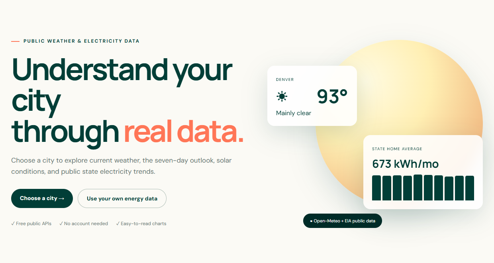
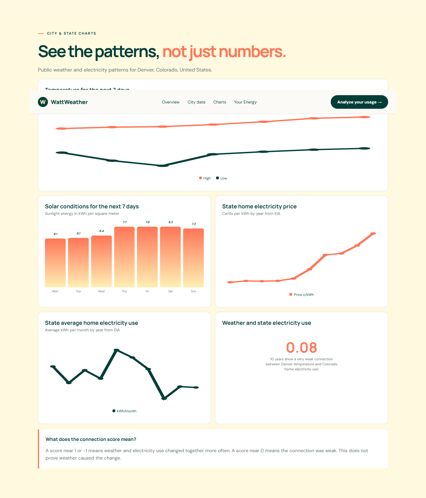
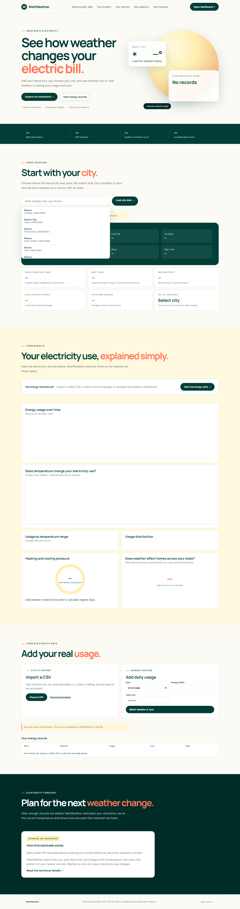
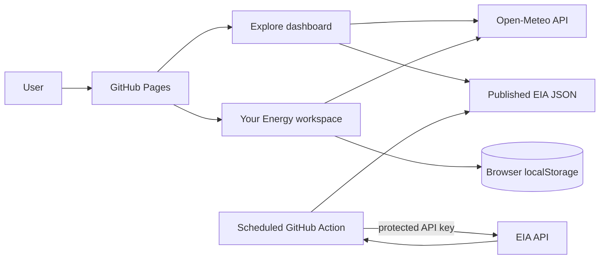
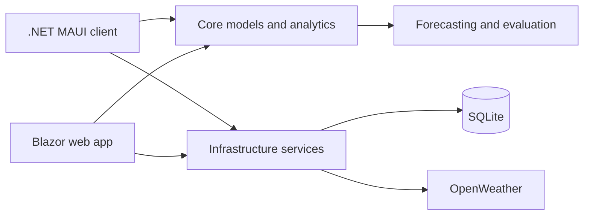

<div align="center">

# WattWeather

### Weather and electricity data people can actually understand

[](https://sampbaer-creator.github.io/WattWeather/)
[](https://sampbaer-creator.github.io/WattWeather/)
[](https://github.com/sampbaer-creator/WattWeather/actions/workflows/ci.yml)
[](https://github.com/sampbaer-creator/WattWeather/actions/workflows/update-eia-data.yml)

WattWeather combines live city weather, public electricity statistics, and optional personal utility records to explain how temperature relates to electricity use and cost.

**[Explore public data](https://sampbaer-creator.github.io/WattWeather/)** · **[Analyze your energy](https://sampbaer-creator.github.io/WattWeather/energy.html)** · **[View the model card](docs/model-card.md)**

</div>



## What WattWeather does

WattWeather is a portfolio project with two intentionally separate experiences:

| Experience | Purpose | Data |
|---|---|---|
| **Explore** | Understand a city through live conditions and public charts | Open-Meteo weather and solar data; EIA state electricity statistics |
| **Your Energy** | Understand a household’s real electricity records | User-provided CSV/manual kWh and cost, matched to historical city weather |

The public dashboard does not pretend state averages are household measurements. Personal records remain in browser-local storage and are never uploaded to this repository.

## Public Explore dashboard



- City autocomplete with mouse and keyboard navigation
- Current temperature, feels-like temperature, humidity, wind, daily high, and daily low
- Seven-day high/low temperature chart
- Seven-day solar-resource chart
- Latest state residential electricity price
- Latest state average monthly household electricity use
- Ten-year EIA price and household-usage trends
- Ten-year comparison between selected-city temperature and state residential use
- Plain-language explanations of correlation and data limitations

## Your Energy workspace



- Import utility CSV files or enter daily records manually
- Store records privately in the current browser
- Match each record to historical weather by date and selected city
- Calculate total, average, median, minimum, maximum, and standard deviation
- Compare personal monthly usage with the state household average
- Visualize electricity usage over time
- Plot temperature against kWh
- Group average usage into understandable temperature ranges
- Calculate heating and cooling pressure
- Flag unusually high records with an explainable IQR method
- Estimate usage at the current temperature after enough records exist
- Evaluate forecasts with MAE, RMSE, and R² using a chronological test set

### CSV format

WattWeather accepts `date` and `kwh`; `cost` is optional.

```csv
date,kwh,cost
2026-01-01,24.5,3.55
2026-01-02,27.1,3.93
```

## Data sources

| Source | Used for | Notes |
|---|---|---|
| [Open-Meteo](https://open-meteo.com/) | City search, current weather, forecasts, historical temperature, solar resource | Browser requests require no private key |
| [U.S. EIA Open Data](https://www.eia.gov/opendata/) | State residential price, customers, and electricity sales | Refreshed by a protected GitHub Action |
| User utility records | Personal kWh and cost | Remain in the user’s browser |
| OpenWeather | Native .NET client weather | Key is supplied through local secrets/environment configuration |

EIA annual residential sales are divided by residential customers and 12 to produce an understandable state average in kWh per household per month. A selected city’s annual temperature is used as a local climate proxy when comparing weather with state electricity use. That relationship is an association, not proof of causation.

## Architecture



The repository also contains a layered .NET implementation:



## Technology

- JavaScript, HTML, and responsive CSS for the deployed GitHub Pages experience
- C# and .NET 10
- .NET MAUI with MVVM and dependency injection
- Blazor
- Entity Framework Core and SQLite
- Strongly typed REST integration with async/await
- GitHub Actions for CI, Pages, and protected EIA refreshes
- xUnit and FluentAssertions

## Repository structure

```text
index.html / landing.js / pages*.css       Public Explore dashboard
energy.html / pages.js                     Private Your Energy workspace
data/eia-state-energy.json                 Published non-sensitive EIA snapshot
scripts/fetch-eia-data.mjs                 Protected EIA refresh process
OpenWeather/                               .NET MAUI client
src/WeatherEnergyAnalytics.Core/           Domain, statistics, forecasting
src/WeatherEnergyAnalytics.Infrastructure/ SQLite, repositories, API services
src/WeatherEnergyAnalytics.Web/            Blazor application
tests/                                     Unit and integration tests
docs/                                      Data, model, BI, and roadmap documentation
```

## Run locally

### GitHub Pages version

Serve the repository root with any static server:

```powershell
python -m http.server 8080
```

Open `http://localhost:8080`.

### .NET web application

Requires the .NET 10 SDK:

```powershell
dotnet run --project src/WeatherEnergyAnalytics.Web
```

The SQLite database starts empty. Configure live OpenWeather access with user secrets:

```powershell
dotnet user-secrets init --project src/WeatherEnergyAnalytics.Web
dotnet user-secrets set "OpenWeather:ApiKey" "YOUR_KEY" --project src/WeatherEnergyAnalytics.Web
```

### .NET MAUI Windows client

```powershell
dotnet workload install maui-windows
dotnet restore OpenWeather/OpenWeather.csproj -r win-x64
dotnet run --project OpenWeather/OpenWeather.csproj -f net10.0-windows10.0.19041.0 -r win-x64
```

## Build and test

```powershell
dotnet build src/WeatherEnergyAnalytics.Web -c Release
dotnet test tests/WeatherEnergyAnalytics.Core.Tests -c Release
dotnet test tests/WeatherEnergyAnalytics.Infrastructure.Tests -c Release
```

The automated suite covers input validation, calculations, anomaly behavior, forecast safeguards, SQLite initialization, and repeatable data operations without requiring live API calls.

## Security and privacy

- No API keys are committed to the current source
- The EIA key is stored as an encrypted GitHub Actions secret
- Pages receives only public aggregate EIA JSON
- Personal electricity records stay in browser-local storage
- The full EIA key is never sent to website visitors
- Network failures produce user-facing errors without exposing implementation details

> A key from the original class assignment was previously committed. It was removed from active source and should remain revoked because Git history cannot make an exposed credential private.

## Project background

This project began as a basic .NET MAUI assignment that searched OpenWeather by ZIP code and displayed temperatures on a second page. It was expanded into a maintainable weather-and-electricity analytics platform to demonstrate API integration, data modeling, statistical analysis, forecasting, visualization, security, automated testing, and professional GitHub delivery.

## Documentation

- [Data dictionary and SQL examples](docs/data-and-sql.md)
- [Forecast model card](docs/model-card.md)
- [Power BI and Azure roadmap](docs/bi-azure-roadmap.md)
- [Roadmap, lessons learned, and resume bullets](docs/roadmap.md)

## Current limitations

- Public EIA electricity values are state averages, not city or household meter readings
- City temperature is a climate proxy in the state-level comparison
- Personal forecast quality depends on record frequency, date coverage, and missing data
- Browser-local records do not automatically synchronize across devices
- Direct utility-account connections require a secure backend and provider authorization

## Roadmap

- Green Button and broader utility-export support
- More robust CSV column mapping
- Confidence ranges around forecasts
- Optional encrypted account synchronization
- Additional accessibility and end-to-end tests
- Azure SQL and Power BI expansion
