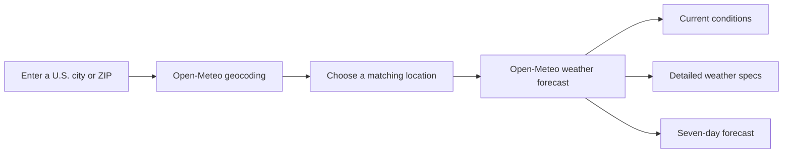

# WattWeather

### Simple, friendly weather for any U.S. city or ZIP code.

WattWeather is a responsive weather application built with C# and Blazor WebAssembly. Enter a U.S. city or ZIP code to quickly see current conditions, detailed weather measurements, and a seven-day forecast—no account required.

[Open WattWeather](https://sampbaer-creator.github.io/WattWeather/) · [Explore the architecture](https://sampbaer-creator.github.io/WattWeather/architecture)

## What it does

- Searches U.S. locations by city name or ZIP code
- Shows the current temperature and “feels like” temperature
- Displays the current condition with a friendly day or night icon
- Shows today’s high and low temperatures
- Reports humidity, precipitation, cloud cover, and surface pressure
- Shows wind speed and compass direction
- Displays the UV index, sunrise, and sunset
- Provides a seven-day forecast with daily highs, lows, rain chances, and wind
- Creates shareable city forecast links without including personal information
- Adapts to desktop and mobile screens
- Handles loading, empty, network-error, and unavailable-data states

## Technology

| Area | Technology | Purpose |
| --- | --- | --- |
| Front end | C# and Blazor WebAssembly | Components, application state, routing, and the interactive weather experience |
| Weather data | Open-Meteo APIs | U.S. geocoding, live weather conditions, and seven-day forecasts |
| Optional backend | ASP.NET Core | Same-origin API proxying, validation, caching, rate limiting, and security headers |
| Styling | CSS | Responsive layouts, weather cards, loading skeletons, and accessible visual states |
| Testing | xUnit | Weather-code presentation, forecast requests, and backend security behavior |
| Hosting | GitHub Pages | Public static deployment of the Blazor WebAssembly application |

## How it works



The GitHub Pages edition calls Open-Meteo’s public HTTPS endpoints directly. The optional ASP.NET Core edition exposes validated, same-origin endpoints and adds server-side caching and rate limiting.

## Project structure

```text
app/
  Models/       Strongly typed weather and location data
  Pages/        Weather overview and architecture pages
  Services/     Open-Meteo requests and weather presentation logic
  Shared/       Navigation and reusable layout components
  wwwroot/      Styles, metadata, and static assets

server/         Optional ASP.NET Core weather API proxy
tests/          Deterministic xUnit tests
```

## Run locally

Requirements: a current .NET SDK compatible with the solution.

```powershell
git clone https://github.com/sampbaer-creator/WattWeather.git
cd WattWeather
dotnet restore WattWeather.slnx
dotnet run --project server/WattWeather.Server.csproj
```

Open the local address printed by ASP.NET Core.

## Build and test

```powershell
dotnet build WattWeather.slnx -c Release
dotnet test WattWeather.slnx -c Release
```

The test suite covers weather-code labels, day and night icons, compass directions, forecast request fields, routing, and backend security behavior.

## Data and privacy

- Weather and location results come from Open-Meteo.
- No Open-Meteo API key is required.
- WattWeather does not require an account.
- Shared links contain only the selected city and state.
- The app does not collect utility bills or household energy records.
- Weather information is informational and should not replace official emergency alerts.

## Deployment

Every push to `main` runs the project checks and publishes the Blazor WebAssembly application to GitHub Pages:

https://sampbaer-creator.github.io/WattWeather/

## Project status

Active portfolio project. The current version is intentionally focused on one experience: helping someone quickly understand the weather in any U.S. city or ZIP code.
