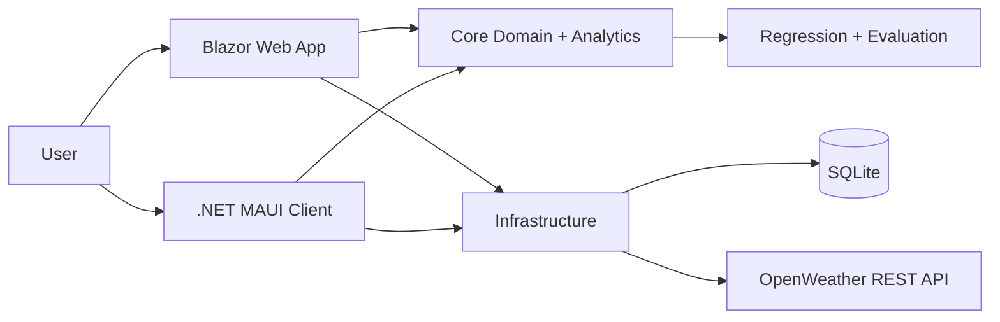
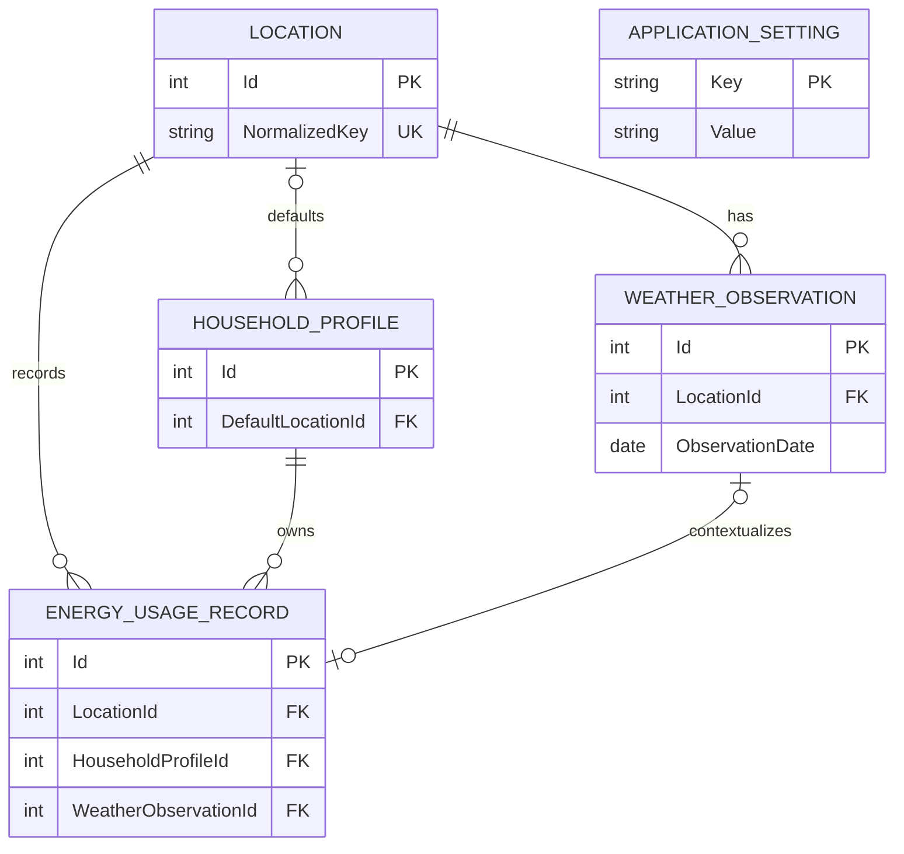

# WattWeather

Weather and household energy intelligence built with C#, .NET MAUI, Blazor, SQLite, statistical analysis, and explainable forecasting.

> **Status:** Active portfolio project. The original ZIP-code weather assignment has been rebuilt around shared domain and infrastructure libraries. The repository includes a Windows MAUI client and a responsive Blazor web application.

## Why this project exists

Weather is one of the largest drivers of household electricity demand, but utility records rarely explain *why* usage changed. WattWeather links daily energy records to weather observations, calculates decision-friendly KPIs, flags unusual days, and estimates future usage without presenting predictions as guarantees.

## Highlights

- Live weather by US ZIP code or city through OpenWeather
- Strongly typed JSON mapping, `HttpClient`, async/await, cancellation, timeouts, and friendly failure states
- Local SQLite relational database with locations, households, weather, energy, and settings
- Deterministic two-year synthetic dataset (730 daily rows) for an immediate demonstration
- Total, average, median, range, standard deviation, cost, degree-day, correlation, seasonal, and month-over-month analytics
- Explainable IQR anomaly detection
- Regularized multiple linear regression with chronological 80/20 validation
- MAE, RMSE, and R² model evaluation
- Responsive web landing page, analytics dashboard, weather search, energy table, and model card
- .NET MAUI MVVM client with dependency injection and no business logic in page code-behind
- Automated tests that do not require a live API

## Screenshots

Add final captures to `docs/screenshots/` after running the projects. Suggested views: landing page, live weather, analytics dashboard, forecast model card, and MAUI client.

## Architecture





## Repository structure

```text
OpenWeather/                         .NET MAUI Windows client
src/WeatherEnergyAnalytics.Core/     Models, validation, statistics, forecasting
src/WeatherEnergyAnalytics.Infrastructure/ SQLite, repositories, weather API, seeding
src/WeatherEnergyAnalytics.Web/      Responsive Blazor web app and landing page
src/WeatherEnergyAnalytics.ModelTrainer/ Model workflow entry point
tests/                               Deterministic unit and integration tests
docs/                                Data, BI, security, and model documentation
```

## Run the web app

Requirements: .NET 10 SDK.

```powershell
dotnet run --project src/WeatherEnergyAnalytics.Web
```

The app creates `src/WeatherEnergyAnalytics.Web/App_Data/weather-energy.db` and seeds 730 synthetic records on first run.

For live weather, never place a real key in `appsettings.json`:

```powershell
dotnet user-secrets init --project src/WeatherEnergyAnalytics.Web
dotnet user-secrets set "OpenWeather:ApiKey" "YOUR_KEY" --project src/WeatherEnergyAnalytics.Web
```

Alternatively set `OPENWEATHER_API_KEY` in the local environment. The interface never displays the full key.

## Run the MAUI app

```powershell
dotnet workload install maui-windows
dotnet build OpenWeather/OpenWeather.csproj -f net10.0-windows10.0.19041.0
dotnet run --project OpenWeather/OpenWeather.csproj -f net10.0-windows10.0.19041.0
```

Set `OPENWEATHER_API_KEY` before launching to enable live weather.

## Build and test

```powershell
dotnet build src/WeatherEnergyAnalytics.Web
dotnet test tests/WeatherEnergyAnalytics.Core.Tests
dotnet test tests/WeatherEnergyAnalytics.Infrastructure.Tests
```

## Analytics definitions

- **Estimated monthly usage/cost:** latest 30-day average multiplied by 30.
- **Temperature correlation:** Pearson correlation between mean temperature and kWh. Association does not prove causation.
- **HDD/CDD:** daily deviation below/above a 65°F base.
- **Unusual usage:** values outside 1.5 × IQR. These are review candidates, not guaranteed errors.
- **Month-over-month:** percentage change between the latest two complete monthly groups.

## Forecasting

The baseline is an explainable regularized multiple linear regression using average temperature, humidity, heating/cooling degree days, home size, occupants, month, AC hours, and previous usage. Data is sorted by date and split 80/20 so evaluation occurs on later observations. The app refuses to train with fewer than 90 rows spanning six months. Predictions are labeled estimates.

See [the model card](docs/model-card.md) for limitations and intended use.

## Data provenance and security

The seeded dataset is deterministic and explicitly marked synthetic. Live conditions come from OpenWeather. The architecture supports saved observations going forward; imported historical data should retain its source label. A previously committed API key was removed from active code and must be revoked because deletion from the latest version does not erase Git history.

## Documentation

- [Data dictionary and SQL](docs/data-and-sql.md)
- [Model card](docs/model-card.md)
- [Power BI and Azure roadmap](docs/bi-azure-roadmap.md)
- [Roadmap, lessons, and resume bullets](docs/roadmap.md)

## License recommendation

MIT is a practical choice for a public portfolio repository. Add a `LICENSE` only after confirming that this is the license you want.
